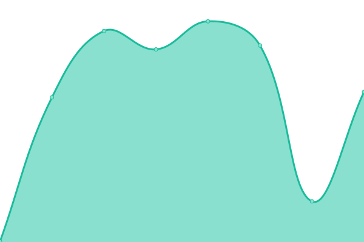
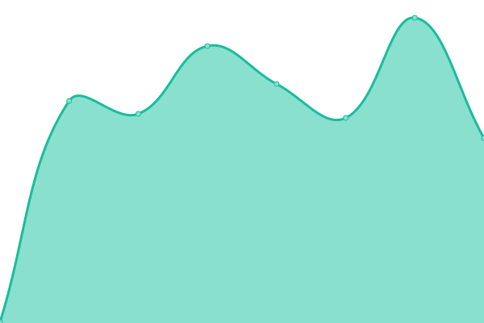
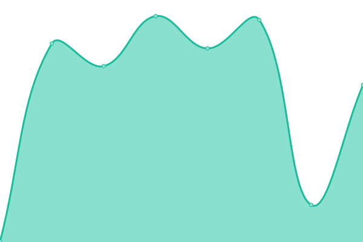
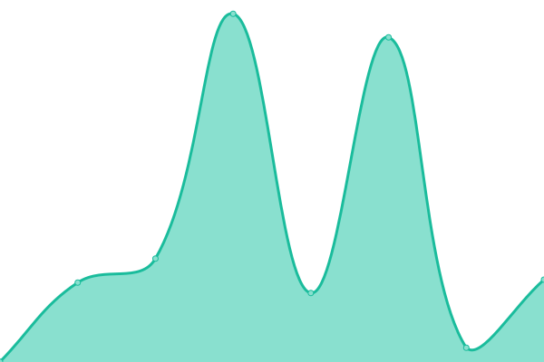
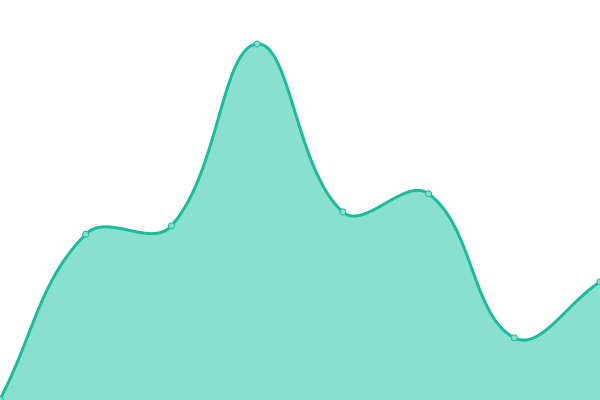

# [📈 Live Status](https://jcortell.github.io/uptime): <!--live status--> **🟩 All systems operational**

This repository contains the open-source uptime monitor and status page for [Jorge Cortell](http://www.kanteron.com), powered by [Upptime](https://github.com/upptime/upptime).

With [Upptime](https://upptime.js.org), you can get your own unlimited and free uptime monitor and status page, powered entirely by a GitHub repository. We use [Issues](https://github.com/jcortell/uptime/issues) as incident reports, [Actions](https://github.com/jcortell/uptime/actions) as uptime monitors, and [Pages](https://jcortell.github.io/uptime) for the status page.

<!--start: status pages-->
<!-- This summary is generated by Upptime (https://github.com/upptime/upptime) -->
<!-- Do not edit this manually, your changes will be overwritten -->
<!-- prettier-ignore -->
| URL | Status | History | Response Time | Uptime |
| --- | ------ | ------- | ------------- | ------ |
|  [Kanteron Website](https://www.kanteron.com/) | 🟩 Up | [kanteron-website.yml](https://github.com/jcortell/uptime/commits/HEAD/history/kanteron-website.yml) | 

 392ms
     
 | 

<a href="https://jcortell.github.io/uptime/history/kanteron-website">100.00%</a>
    

|  [Kanteron Sitio Web](https://web.kanteron.com/) | 🟩 Up | [kanteron-sitio-web.yml](https://github.com/jcortell/uptime/commits/HEAD/history/kanteron-sitio-web.yml) | 

 548ms
     
 | 

<a href="https://jcortell.github.io/uptime/history/kanteron-sitio-web">100.00%</a>
    

|  [Kanteron Blog](https://blog.kanteron.com/) | 🟩 Up | [kanteron-blog.yml](https://github.com/jcortell/uptime/commits/HEAD/history/kanteron-blog.yml) | 

 154ms
     
 | 

<a href="https://jcortell.github.io/uptime/history/kanteron-blog">100.00%</a>
    

|  [Blog de Kanteron](https://bloges.kanteron.com/) | 🟩 Up | [blog-de-kanteron.yml](https://github.com/jcortell/uptime/commits/HEAD/history/blog-de-kanteron.yml) | 

 168ms
     
 | 

<a href="https://jcortell.github.io/uptime/history/blog-de-kanteron">100.00%</a>
    

|  [Jorge Website](https://jorge.cortell.net/) | 🟩 Up | [jorge-website.yml](https://github.com/jcortell/uptime/commits/HEAD/history/jorge-website.yml) | 

 494ms
     
 | 

<a href="https://jcortell.github.io/uptime/history/jorge-website">100.00%</a>
    

|  [Jorge Sitio Web](https://web.cortell.net/) | 🟩 Up | [jorge-sitio-web.yml](https://github.com/jcortell/uptime/commits/HEAD/history/jorge-sitio-web.yml) | 

 438ms
     
 | 

<a href="https://jcortell.github.io/uptime/history/jorge-sitio-web">100.00%</a>
    

|  [Jorge Blog](https://blog.cortell.net/) | 🟩 Up | [jorge-blog.yml](https://github.com/jcortell/uptime/commits/HEAD/history/jorge-blog.yml) | 

 149ms
     
 | 

<a href="https://jcortell.github.io/uptime/history/jorge-blog">100.00%</a>
    

|  [Blog de Jorge](https://bloges.cortell.net/) | 🟩 Up | [blog-de-jorge.yml](https://github.com/jcortell/uptime/commits/HEAD/history/blog-de-jorge.yml) | 

 185ms
     
 | 

<a href="https://jcortell.github.io/uptime/history/blog-de-jorge">100.00%</a>
    

|  [Hugo Website](https://hugo.cortell.net/) | 🟩 Up | [hugo-website.yml](https://github.com/jcortell/uptime/commits/HEAD/history/hugo-website.yml) | 

 359ms
     
 | 

<a href="https://jcortell.github.io/uptime/history/hugo-website">100.00%</a>
    

|  [DolceVita Seas Website](https://www.dolcevitaseas.com/) | 🟩 Up | [dolce-vita-seas-website.yml](https://github.com/jcortell/uptime/commits/HEAD/history/dolce-vita-seas-website.yml) | 

 295ms
     
 | 

<a href="https://jcortell.github.io/uptime/history/dolce-vita-seas-website">100.00%</a>
    

|  [CruiseCurator Website (redirects to Virtuoso)](https://www.virtuoso.com/advisor/stepseri33810/advisors/16133810/stephanie-serino) | 🟩 Up | [cruise-curator-website-redirects-to-virtuoso.yml](https://github.com/jcortell/uptime/commits/HEAD/history/cruise-curator-website-redirects-to-virtuoso.yml) | 

 636ms
     
 | 

<a href="https://jcortell.github.io/uptime/history/cruise-curator-website-redirects-to-virtuoso">99.84%</a>
    

<!--end: status pages-->

[**Visit our status website →**](https://jcortell.github.io/uptime)

## 📄 License

- Powered by: [Upptime](https://github.com/upptime/upptime)
- Code: [MIT](./LICENSE) © [Jorge Cortell](http://www.kanteron.com)
- Data in the `./history` directory: [Open Database License](https://opendatacommons.org/licenses/odbl/1-0/)
